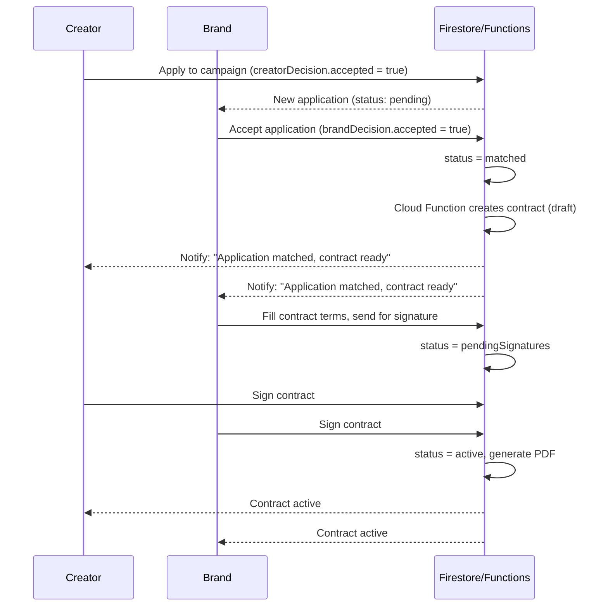

# Influencer Collaboration Platform — Post-Onboarding Flow Specification

This document defines the complete flow, page structure, data model, and business logic for the Creator and Brand experiences after Firebase login/onboarding. It's written so an AI coding agent (e.g. Antigravity) can implement it directly on top of your existing Firebase project.

---

## 0. Hard Constraint: Do Not Touch Existing Auth Flows

**Google Sign-In (Firebase Auth) and the existing Instagram connect/login flow must remain exactly as they are.** This spec only adds new pages, collections, and post-onboarding logic on top of them. Rules for Antigravity:

- **Do not remove, replace, rewrite, or refactor** the existing Google Auth (Firebase) sign-in/sign-up flow or the existing Instagram OAuth/connect flow, even if it looks messy or could "cleanly" be merged into the new social-verification logic in Section 7.
- **Bug fixes are allowed and encouraged** if something is broken (e.g. brand-side login edge cases mentioned earlier) — but a fix means: locate the specific broken behavior, patch only that logic, and leave the surrounding flow, function names, redirect URIs, Firebase config, and Instagram API scopes untouched.
- The **Instagram verification badge logic in Section 7** should be built by *reading the result* of the existing Instagram connect flow (i.e. checking whatever field/token/flag it already sets on success) — not by introducing a second, parallel Instagram auth flow. If the existing flow doesn't currently persist a clean "connected/verified" flag, the minimal fix is to add that flag at the point where the existing flow already succeeds, not to rebuild the flow.
- Any new social platforms (YouTube, TikTok, X/Twitter) can follow a *similar pattern* to the existing Instagram flow, but must be added as **new, separate integrations** — never by modifying the Instagram code path itself.
- Before changing anything in the auth files, Antigravity should first map out: (a) where Google Auth is initialized, (b) where the Instagram OAuth callback/token exchange lives, (c) what Firestore fields they currently write on success — and confirm none of these are being altered as a side effect of adding the new pages/routes in this spec.
- If the brand-side login issue mentioned separately turns out to require a structural change to the shared auth flow (rather than a brand-specific branch), flag it back to the user before proceeding, rather than silently modifying the flow both roles depend on.

---

## 1. High-Level Architecture

```
Firebase Auth (existing) 
      │
      ▼
users/{uid}  → role: "creator" | "brand"
      │
      ├── role = creator → onboarded? → Creator App Shell
      └── role = brand   → onboarded? → Brand App Shell
```

Both shells share the same backend collections but render different UIs and query filters.

### Firestore Collections (proposed)

```
users/{uid}
  ├─ role: "creator" | "brand"
  ├─ email, createdAt, onboardingComplete: boolean
  └─ niche: string[]              // used for matching both sides

creatorProfiles/{uid}
  ├─ uid, displayName, bio, avatarUrl
  ├─ niche: string[]
  ├─ socialLinks: { instagram, youtube, tiktok, twitter, ... }
  ├─ socialVerification: {
  │     instagram: { verified: bool, verifiedAt, method },
  │     youtube:   { verified: bool, verifiedAt, method },
  │     ...
  │  }
  ├─ isVerified: boolean          // true if ANY platform verified
  ├─ stats: { followers, engagementRate, avgViews }
  └─ portfolio: [ { title, mediaUrl, campaignRef } ]

brandProfiles/{uid}
  ├─ uid, companyName, logoUrl, website, description
  ├─ niche: string[]              // industry/category tags
  ├─ isVerified: boolean          // e.g. business email / doc verification
  └─ stats: { campaignsPosted, activeCollabs }

campaigns/{campaignId}
  ├─ brandId, title, description, niche: string[]
  ├─ budget, deliverables[], deadline
  ├─ status: "active" | "closed" | "draft"
  └─ createdAt

applications/{applicationId}
  ├─ campaignId, brandId, creatorId
  ├─ initiatedBy: "creator" | "brand"   // who applied / who invited
  ├─ status: "pending" | "creatorAccepted" | "brandAccepted"
  │           | "matched" | "rejectedByCreator" | "rejectedByBrand"
  ├─ message: string                     // pitch/note
  ├─ creatorDecision: { accepted: bool|null, decidedAt }
  ├─ brandDecision:   { accepted: bool|null, decidedAt }
  ├─ contractId: string | null
  └─ createdAt, updatedAt

chats/{chatId}
  ├─ participants: [creatorId, brandId]
  ├─ applicationId (optional link)
  ├─ lastMessage, lastMessageAt
  └─ messages/{messageId} (subcollection)
        ├─ senderId, text, attachments[], sentAt, readBy[]

contracts/{contractId}
  ├─ applicationId, campaignId, brandId, creatorId
  ├─ terms: { deliverables[], budget, timeline, paymentSchedule, usageRights }
  ├─ status: "draft" | "pendingSignatures" | "signedByCreator"
  │           | "signedByBrand" | "active" | "completed" | "cancelled"
  ├─ signatures: {
  │     creator: { signed: bool, signedAt, name },
  │     brand:   { signed: bool, signedAt, name }
  │  }
  ├─ pdfUrl: string          // generated contract document
  └─ createdAt, updatedAt

analyticsSnapshots/{uid}_{date}
  ├─ uid, role, date
  └─ metrics: { ... role-specific }
```

---

## 2. Routing Logic After Login

```
onAuthStateChanged(user):
  fetch users/{uid}
  if !onboardingComplete → route to existing onboarding flow (unchanged)
  else:
    if role == "creator" → navigate("/creator/campaigns")   // default landing
    if role == "brand"   → navigate("/brand/discover")      // default landing
```

Both roles get a persistent bottom/side nav with role-specific tabs (see below).

---

## 3. Creator Experience

### Nav tabs (Creator)
`Campaigns | Applications | Chat | Analytics | Profile`

### 3.1 Campaigns Page (`/creator/campaigns`)
**Purpose:** Discover brand campaigns matching the creator's niche.

- Query: `campaigns` where `status == "active"` AND `niche array-contains-any creatorProfile.niche`
- Sort: newest first, optionally by budget or deadline
- Each campaign card shows: brand logo/name, title, budget range, deliverables summary, deadline, niche tags
- Tap → Campaign Detail (brand info, full description, "Apply" button)
- **Apply action** → creates `applications/{id}` doc:
  ```
  { campaignId, brandId, creatorId, initiatedBy: "creator",
    status: "pending", brandDecision: {accepted: null}, creatorDecision: {accepted: true, decidedAt: now} }
  ```
  (Creator applying = implicit creator acceptance already logged; brand still needs to decide.)
- Filter/search bar: by niche, budget range, deadline

### 3.2 Profile Page (`/creator/profile`)
**Purpose:** Show creator's full profile + verification.

- Sections: Avatar, display name, bio, niche tags
- **Social accounts block**: each platform shows connect/verify button
  - Verification method options:
    - OAuth connect (Instagram Graph API / YouTube Data API / TikTok Login Kit) — auto-verifies ownership
    - Fallback: "Add this code to your bio" manual verification + admin/automated check
  - Verified accounts show a ✅ badge next to the platform icon
  - `isVerified` on the profile = `true` if **any** social platform is verified; show a general "Verified Creator" badge on the profile header and on campaign/application cards
- Stats block: followers, engagement rate, avg views (pulled from connected APIs where possible)
- Portfolio/past work section
- Edit button → edit mode for bio/niche/portfolio

### 3.3 Chat Page (`/creator/chat`)
**Purpose:** Negotiate with brands.

- Chat list: all `chats` where `participants array-contains uid`, sorted by `lastMessageAt`
- Each thread ideally linked to an `applicationId` so context (campaign, offer terms) is pinned at the top of the conversation
- Standard messaging UI: text messages, optional file/image attachment, read receipts
- Quick-action buttons inside chat tied to the linked application: "View Application", "Accept Offer", "Propose Contract Terms" (if you want negotiation-to-contract shortcut)

### 3.4 Analytics Page (`/creator/analytics`)
**Purpose:** Creator performance overview.

- Metrics: profile views, applications sent, acceptance rate, active collaborations, completed contracts, earnings summary (if payments tracked), follower growth trend (from social APIs)
- Charts: line chart (growth over time), bar chart (applications by status)
- Data source: `analyticsSnapshots` aggregated, or computed on-the-fly from `applications`/`contracts`

---

## 4. Brand Experience

### Nav tabs (Brand)
`Discover Creators | Applications | Chat | Analytics | Profile`

### 4.1 Discover Creators Page (`/brand/discover`)
**Purpose:** Show creators matching the brand's niche (mirror of Creator's Campaigns page).

- Query: `creatorProfiles` where `niche array-contains-any brandProfile.niche`
- Optional: only show creators above a min follower/engagement threshold (brand-set filter)
- Each creator card: avatar, name, niche tags, verified badge (if `isVerified`), follower count, engagement rate
- Tap → Creator Detail (full profile view, portfolio, stats)
- **Invite to campaign** action → brand picks one of their active campaigns → creates `applications/{id}`:
  ```
  { campaignId, brandId, creatorId, initiatedBy: "brand",
    status: "pending", creatorDecision: {accepted: null}, brandDecision: {accepted: true, decidedAt: now} }
  ```
- Brand also needs a "My Campaigns" management view (create/edit/close campaign) — likely already exists or should be added here as a sub-tab.

### 4.2 Chat Page (`/brand/chat`)
Same structure as Creator's chat page, symmetric.

### 4.3 Analytics Page (`/brand/analytics`)
- Metrics: campaigns posted, applications received, acceptance rate, active collaborations, spend summary, top-performing creators
- Charts: campaign performance over time, funnel (invited → pending → matched → completed)

### 4.4 Profile Page (`/brand/profile`)
- Company name, logo, website, description, niche/industry tags
- Verification: business email domain check / document upload → admin review → `isVerified`
- Campaign history summary

---

## 5. Shared: Applications Page (`/applications`)

**Purpose:** Both roles track applications sent/received, with Accept/Reject actions, leading into contract creation.

### Query
```
applications where (creatorId == uid OR brandId == uid)
```
Group into tabs: **Pending | Accepted (awaiting other side) | Matched | Rejected**

### Card content
- Counterpart's name/logo, campaign title, niche, date applied, current status
- Status badge:
  - `pending` — waiting on the other party's first decision
  - `creatorAccepted` — creator said yes, waiting on brand
  - `brandAccepted` — brand said yes, waiting on creator
  - `matched` — both accepted → triggers contract
  - `rejectedByCreator` / `rejectedByBrand` — closed, greyed out

### Decision logic (Cloud Function or client transaction — recommend Cloud Function for integrity)

```js
function decide(applicationId, actingRole, decision /* accept | reject */) {
  const app = get(applications/{applicationId});

  if (decision === "reject") {
    update: status = actingRole === "creator" ? "rejectedByCreator" : "rejectedByBrand";
    return; // terminal state
  }

  // accept
  const field = actingRole === "creator" ? "creatorDecision" : "brandDecision";
  update: { [field]: { accepted: true, decidedAt: now } };

  const otherAccepted = actingRole === "creator"
    ? app.brandDecision.accepted === true
    : app.creatorDecision.accepted === true;

  if (otherAccepted) {
    update: { status: "matched" };
    triggerContractCreation(applicationId); // see section 6
  } else {
    update: { status: actingRole === "creator" ? "creatorAccepted" : "brandAccepted" };
  }
}
```

- Buttons: **Accept** / **Reject** shown only when it's the current user's turn to decide (i.e., their `xDecision.accepted === null`)
- Once `status === "matched"`, replace buttons with **"View Contract"** link

---

## 6. Contract Generation Flow

Triggered automatically when `applications/{id}.status` becomes `"matched"`.

### 6.1 Cloud Function trigger
```js
exports.onApplicationMatched = onDocumentUpdated("applications/{id}", async (event) => {
  const before = event.data.before.data();
  const after = event.data.after.data();
  if (before.status !== "matched" && after.status === "matched") {
    const campaign = await getCampaign(after.campaignId);
    const contractRef = await db.collection("contracts").add({
      applicationId: event.params.id,
      campaignId: after.campaignId,
      brandId: after.brandId,
      creatorId: after.creatorId,
      terms: {
        deliverables: campaign.deliverables,
        budget: campaign.budget,
        timeline: campaign.deadline,
        paymentSchedule: "TBD - editable before signing",
        usageRights: "TBD - editable before signing"
      },
      status: "draft",
      signatures: {
        creator: { signed: false },
        brand: { signed: false }
      },
      createdAt: now
    });
    await db.collection("applications").doc(event.params.id)
      .update({ contractId: contractRef.id });
  }
});
```

### 6.2 Contract Page (`/contract/{contractId}`)
Accessible to both parties.

- Displays editable terms **while status = "draft"** (either party can propose edits — consider a simple `pendingChanges` sub-object + approve flow, or keep v1 simple: brand fills terms, creator just reviews)
- "Send for Signature" button (brand side, since they set terms) → `status = "pendingSignatures"`
- Each party gets a **Sign** button once status is `pendingSignatures`
  - On sign: `signatures.{role}.signed = true`, `signedAt`, typed legal name as e-signature
  - When both `signatures.creator.signed && signatures.brand.signed` → `status = "active"`
- Generate a PDF snapshot of the signed contract (server-side, e.g. via a PDF library in a Cloud Function) → store URL in `pdfUrl`
- Once `active`, contract appears in both parties' "My Contracts" list (can live inside Applications page as a filter, or its own tab)
- Optional: `status = "completed"` set manually or after deadline passes, for analytics purposes

---

## 7. Verification Badge Logic (Creator)

Single source of truth: `creatorProfiles/{uid}.isVerified`

```js
// recompute whenever socialVerification changes
isVerified = Object.values(socialVerification).some(p => p.verified === true);
```

Show badge:
- On Profile page header
- On Campaigns page (creator's own view, informational)
- On Brand's Discover Creators cards (so brands can filter/trust)

---

## 8. Suggested Firestore Security Rules (summary, not exhaustive)

- `users/{uid}`: read/write only by `uid`
- `creatorProfiles/{uid}`: public read (for brands to discover), write only by owner
- `brandProfiles/{uid}`: public read, write only by owner
- `campaigns/{id}`: public read if `status == "active"`, write only by owning brand
- `applications/{id}`: read/write only if `request.auth.uid in [creatorId, brandId]`; decision fields should ideally be mutated via Cloud Function callable (not direct client write) to prevent tampering with the other party's decision
- `chats/{id}` and subcollection `messages`: read/write only if `request.auth.uid in participants`
- `contracts/{id}`: read only if `request.auth.uid in [creatorId, brandId]`; signature fields writable only by the matching role, via callable function

---

## 9. End-to-End Sequence (Match → Contract)



---

## 10. Implementation Checklist for Antigravity

0. **Read Section 0 first.** Map existing Google Auth + Instagram flow code paths and their Firestore writes before touching anything. Fix the known brand-login issue in isolation if it's a scoped bug; escalate if it's structural.
1. Add `role`-based router guard after onboarding (Section 2)
2. Build Creator shell: Campaigns, Applications, Chat, Analytics, Profile (Sections 3, 5)
3. Build Brand shell: Discover, Applications, Chat, Analytics, Profile (Sections 4, 5)
4. Implement shared Applications page with Accept/Reject callable functions (Section 5)
5. Implement social verification flow + `isVerified` badge logic (Section 7)
6. Write `onApplicationMatched` Cloud Function to auto-create contracts (Section 6)
7. Build Contract page with terms editing, signature flow, PDF generation (Section 6.2)
8. Update Firestore security rules (Section 8)
9. Wire up notifications (in-app + optional email/push) for: new application, accepted, matched, contract ready, contract signed
10. Update chat schema to optionally link `applicationId` for context in negotiations

---

*This spec assumes your existing Firebase Auth and onboarding flow remain unchanged — only the post-onboarding structure and the collections listed above are new/modified.*
